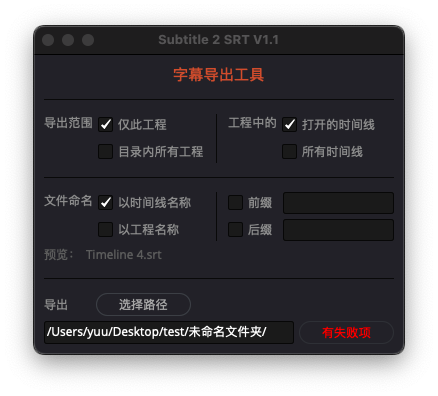

# DaVinci Resolve Subtitle Export SRT Tool
___
## Function
This plugin can help you automatically export subtitles on the timeline as SRT files in batches, so you don't have to work overtime for this kind of mechanical work. Leave it all to your computer after work.
## Instructions
A very simple tool that can read the contents of subtitle track 1 and export SRT. Currently supports 24 frames and 25 frames of timeline.
    

### Range Selection
* When selecting `「目录内所有工程」` on the left, it will export all projects in the folder where the current project in the project manager is located, excluding **subfolders**

    
    

* When selecting `「所有时间线」` on the right, it will export all timelines in the project, and **disabled timelines** will not be exported

    

### File Naming
* There are two ways to name the file, `「以时间线名称」` and `「以工程名称」`, and a **real-time name preview** will be given below
    > When the range selection is `「工程中所有时间线」`, the naming method of `「以工程名称」` cannot be selected

    

* You can add prefixes and suffixes to your SRT
    > For example, the prefix can add the project name and version number, and the suffix can add today's date. For example: **ProjectName_C01_EP01_230416**
    
    

### Export
Click `「选择路径」`, or directly paste the path into the dialog box below, and click `「导出」`
* Clicking the `「导出」` button will automatically save the current project
* After the export is completed, the `「导出」` button will become **unselectable** to avoid accidentally running it again (it takes a long time to open a project with 40 episodes). Changing any other settings can refresh the `「导出」` button

    

* If you click `「导出」` when the export path does not exist, it will prompt **路径不存在**, please select the path again or change other settings to refresh the `「导出」` button status.

    

* If there are no subtitles on some timelines, it will prompt **有失败项**, open the console to view the error message

    

    

## Known issues
* There may be a 1ms error when exporting SRT on a 25-frame timeline. It is not clear how DaVinci Resolve calculates time codes like 00:00:00,959, but it does not affect normal use.

    `Test method: Use a 30-minute project and export SRT using the script. Then insert the SRT back into the project. The cut points and subtitle block content are consistent with the original subtitles.`
    
    

## Installation
* Put the script file in `/Library/Application Support/Blackmagic Design/DaVinci Resolve/Fusion/Scripts`. If this directory does not exist, you can create one yourself. You can also create a subfolder for easy searching, such as `/Library/Application Support/Blackmagic Design/DaVinci Resolve/Fusion/Scripts/Deliver/Subtitle 2 SRT/`
> * Supports **Python2.7** and **Python3.6**
> * This plugin is developed based on **DaVinci Resolve 17** and has not been tested on **DaVinci Resolve 18**
## Finally
Hope u like it!

